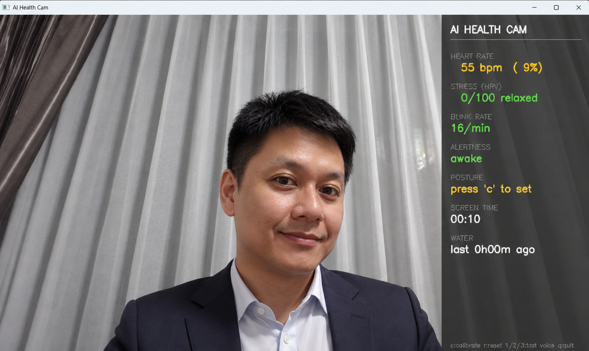
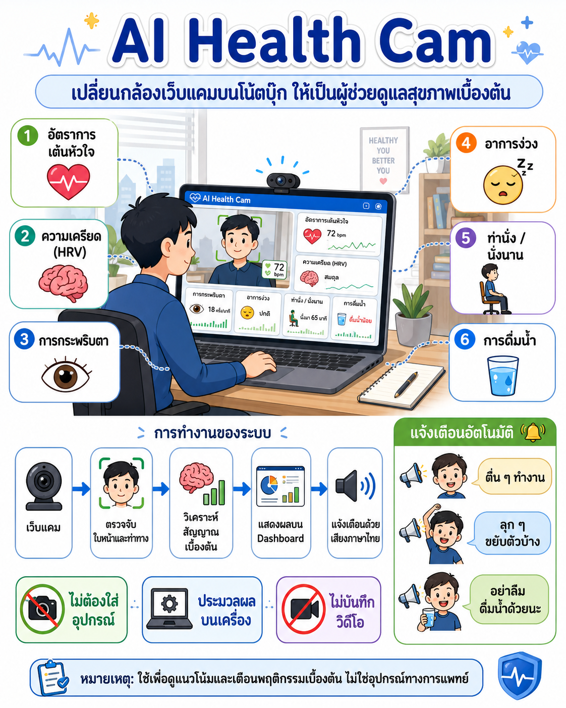
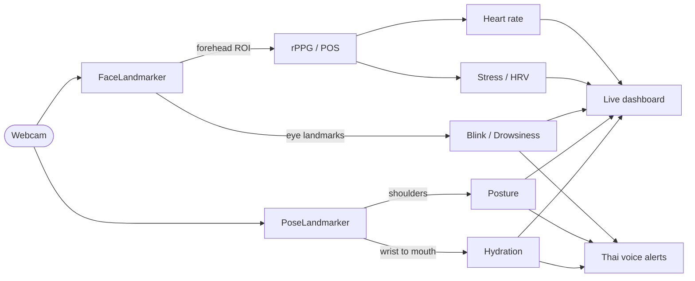

<div align="center">

# AI Health Cam

**A contactless, on-device wellness companion for any laptop webcam.**

Heart rate, stress (HRV), drowsiness, blink rate, posture and hydration —
measured in real time from a single camera, processed entirely on your machine.

[](https://www.python.org/)
[](https://ai.google.dev/edge/mediapipe)
[](https://opencv.org/)
[](#)
[](LICENSE)

<br>



<sub>Live dashboard — vitals computed from a single webcam, processed entirely on-device.</sub>

</div>

---

## Overview

AI Health Cam reads your webcam in real time and renders a live wellness
dashboard — no wearables, no cloud services, and no video is ever stored. When a
condition needs your attention, it speaks a short prompt in natural Thai.

<div align="center">



<sub>System overview (Thai): measurements, processing pipeline, privacy guarantees and voice alerts.</sub>

</div>

---

## Measurements

| Signal | Method | Library |
|---|---|---|
| Heart rate | **rPPG** using the **POS algorithm** (*Plane-Orthogonal-to-Skin*, Wang et al. 2017). Blood pulses shift skin colour imperceptibly; the R/G/B forehead signal is projected onto a skin-tone-orthogonal plane, band-pass filtered (45–240 bpm) and reduced to its FFT peak. | NumPy, SciPy |
| Stress | **Heart-rate variability (RMSSD)** derived from the same pulse waveform. High variability indicates a relaxed (parasympathetic) state; low variability indicates stress. Mapped to a 0–100 index. | SciPy |
| Mood | **Facial-expression recognition** from MediaPipe blendshapes (52 facial muscle scores), mapped to seven emotions — neutral, happy, sad, angry, surprised, fearful, disgusted — plus a positive/negative valence for mood trends. Inspired by face-api.js's expression model, implemented natively on the existing landmark model. | MediaPipe |
| Blink rate | **Eye Aspect Ratio** from 478 face landmarks. Counts blinks per minute and warns below 8/min (prolonged screen focus, dry-eye risk). | MediaPipe |
| Drowsiness | **PERCLOS** — eyes closed beyond a time threshold raises a fatigue alert. | MediaPipe |
| Posture | Shoulder tilt and forward-head / slouch detection from pose landmarks, normalised against a personal calibrated baseline. | MediaPipe |
| Screen time | Continuous-presence timer that prompts regular breaks. | — |
| Hydration | Detects a drinking gesture (wrist to mouth, held briefly), resets a timer, and reminds you if no sip is seen for hours. | MediaPipe |

> AI Health Cam is a wellness and trend tool, not a medical device. Webcam-based
> vitals are approximate; use them to observe trends, never for diagnosis.

---

## Voice alerts

Alerts are synthesised once with **edge-tts** (Microsoft neural Thai voice
*Premwadee*), stored as WAV, and played at runtime through `winsound` — no
internet connection is required while the app is running.

| Trigger | Spoken prompt (Thai) | Meaning |
|---|---|---|
| Drowsy (eyes closed) | ตื่น ๆ ทำงาน | *Wake up, get back to work* |
| Seated longer than 2 h | ลุก ๆ ขยับตัวบ้าง | *Get up and move around* |
| No drink for 4 h | อย่าลืมดื่มน้ำด้วยนะ | *Remember to drink water* |

Each alert has an independent cooldown to prevent repetition. Prompts can be
re-worded or re-generated at any time with `python make_voice.py`.

---

## Architecture



---

## Getting started

```powershell
git clone https://github.com/ksmaster03/claude-canfly_healthcam.git
cd claude-canfly_healthcam

pip install -r requirements.txt
python download_models.py        # face + pose models  (one-time)
python make_voice.py             # Thai alert WAVs      (one-time, needs internet)

python health_cam.py
```

Requires **Python 3.14** and **MediaPipe 0.10.35 or newer**. This build targets
the MediaPipe **Tasks API**, not the legacy `solutions` module.

### Usage

```powershell
python health_cam.py                              # default: break 2 h, water 4 h
python health_cam.py --break-min 1 --water-min 2  # fast-test the alerts
python health_cam.py --no-voice                   # mute voice alerts
python health_cam.py --camera 1                   # select another camera
```

### Controls

| Key | Action |
|----|--------|
| `c` | Calibrate posture (sit upright, then press) |
| `r` | Reset counters (blink, break timer, mark as just hydrated) |
| `1` `2` `3` | Test the voice prompts: drowsy / move / water |
| `q` / `Esc` | Quit |

---

## How it works

<details>
<summary><b>rPPG — why POS rather than a single colour channel</b></summary>

Averaging the green channel of the forehead is dominated by motion and lighting
drift, so it frequently locks onto a low-frequency artefact and reports a heart
rate that is far too low. The POS method uses all three colour channels and
projects them onto a plane orthogonal to the dominant skin-tone direction,
cancelling most motion and illumination noise. A 1.6-second sliding window with
overlap-add reconstructs a clean pulse wave, which is band-pass filtered
(0.75–4 Hz) and transformed with an FFT. The self-test recovers a 72 bpm
synthetic signal to within roughly 2 bpm.
</details>

<details>
<summary><b>Stress — heart-rate variability from a camera</b></summary>

Peaks of the filtered pulse wave yield inter-beat intervals (IBIs). RMSSD — the
root mean square of successive IBI differences — is the standard short-term HRV
metric. It is mapped to a 0–100 stress score and smoothed across updates. Camera
HRV is coarser than a chest strap, so it should be read as a direction rather
than an exact value.
</details>

<details>
<summary><b>Hydration — gesture-based, no additional hardware</b></summary>

Using pose landmarks, a drink is registered when a wrist approaches the mouth
(normalised by shoulder width) and is held briefly. This resets the hydration
timer; crossing the configured threshold raises the reminder.
</details>

---

## Project structure

```
claude-canfly_healthcam/
├── health_cam.py          main loop and live dashboard
├── voice.py               non-blocking Thai voice alerts (winsound + cooldown)
├── make_voice.py          synthesise alert WAVs (edge-tts -> ffmpeg)
├── download_models.py     fetch MediaPipe .task models
├── selftest.py            camera-free unit tests (landmarkers, rPPG, stress)
├── monitors/
│   ├── rppg.py            heart rate (POS algorithm)
│   ├── stress.py          HRV / stress index
│   ├── emotion.py         facial-expression / mood (blendshapes)
│   ├── eyes.py            blink rate and drowsiness (EAR)
│   ├── posture.py         shoulder tilt and slouch
│   └── drink.py           hydration gesture detection
├── models/                *.task  (downloaded, git-ignored)
└── assets/                *.wav   Thai voice clips
```

## Tests

```powershell
python selftest.py     # verifies models load and rPPG / stress math (no camera)
```

---

## Building a standalone executable

The app can be packaged into a self-contained Windows application with
[PyInstaller](https://pyinstaller.org/), so it runs on any 64-bit Windows
machine without a Python installation. The bundled spec collects the MediaPipe
data files and embeds the models and voice clips.

```powershell
pip install pyinstaller
python download_models.py        # ensure models/ exist before bundling
python make_voice.py             # ensure assets/ exist before bundling
pyinstaller build_exe.spec --noconfirm
```

The result is `dist\AIHealthCam\` (~320 MB, mostly MediaPipe / OpenCV / SciPy).
Zip and copy the whole folder to another machine, then run `AIHealthCam.exe`.
Set `console=True` in `build_exe.spec` if you need a debug console while
troubleshooting a build.

### Note on Windows Smart App Control

Windows 11 **Smart App Control (SAC)** blocks unsigned executables and provides
no "run anyway" option. A freshly built, unsigned `AIHealthCam.exe` will be
blocked on a machine where SAC is enforced.

- **Running from source instead of the exe** is the simplest fix: launch with
  `run_health_cam.vbs` (silent) or `run_health_cam.bat`. These run the app
  through the digitally signed Python interpreter, which SAC trusts.
- **Distributing the exe** to SAC-enabled machines requires **code signing**,
  ideally with an EV certificate so it earns reputation immediately.

Do not turn SAC off to work around this — switching it off is a one-way change
that cannot be re-enabled without resetting Windows.

---

## Privacy

All processing happens on-device. There is no network call at runtime, no frame
is stored, and no data leaves the computer. The only network access is the
one-time download of models and voice clips.

---

## Roadmap

- Daily logging and trend charts (heart rate, stress, posture, hydration)
- Windows toast notifications alongside voice
- System-tray background mode without a visible window
- Selectable voice (male *Niwat*), custom phrases, and volume control
- Longer HRV buffer for steadier stress readings

---

## Disclaimer

AI Health Cam is intended for personal wellness and educational use only. It is
not a medical device and must not be used to diagnose, treat, or monitor any
medical condition. Consult a qualified professional for health concerns.

---

## License

[MIT](LICENSE) © ksmaster03

<div align="center">

Part of the <b>claude-canfly</b> toolkit.

</div>
