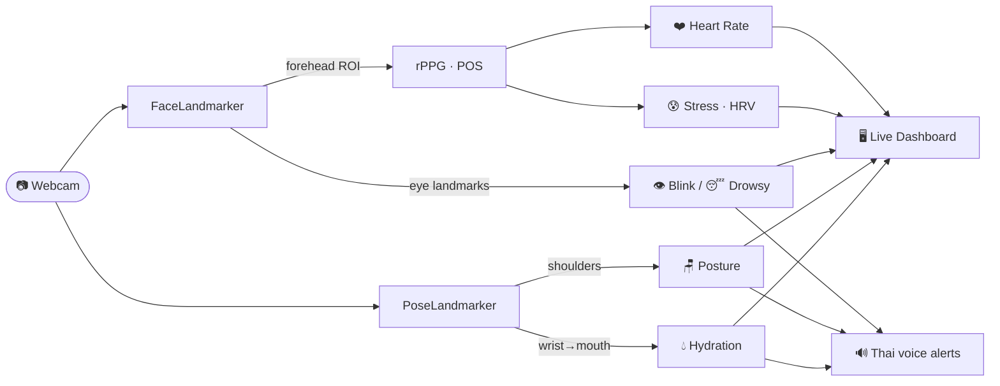

<div align="center">

# 🩺 AI Health Cam

### Turn any laptop webcam into a contactless, on-device wellness companion.

*Heart rate · Stress (HRV) · Drowsiness · Blink rate · Posture · Hydration — all from one camera, all processed locally, nothing ever leaves your machine.*

[](https://www.python.org/)
[](https://ai.google.dev/edge/mediapipe)
[](https://opencv.org/)
[](#)
[](#-privacy-first)
[](LICENSE)

</div>

---

## ✨ What it does

A single Python app reads your webcam in real time and shows a live wellness dashboard — **no wearables, no cloud, no video saved.** When something needs attention it speaks to you in **natural Thai voice**.

```
┌──────────────────────────────────────────────┐
│  [ your webcam feed ]      ╎  AI HEALTH CAM    │
│                            ╎ ───────────────── │
│        ┌──────┐            ╎  HEART RATE       │
│        │ face │  ← rPPG    ╎   72 bpm  (38%)   │
│        └──────┘            ╎  STRESS (HRV)     │
│         /    \             ╎   24/100 relaxed  │
│      shoulders ← posture   ╎  BLINK RATE       │
│                            ╎   17/min          │
│                            ╎  ALERTNESS  awake │
│                            ╎  POSTURE    good  │
│                            ╎  SCREEN TIME 04:12│
│                            ╎  WATER  last 0h21m│
└──────────────────────────────────────────────┘
```

---

## 🧠 What it measures — and the science behind it

| Signal | How it works | Library |
|---|---|---|
| ❤️ **Heart Rate** | **rPPG** via the **POS algorithm** (*Plane-Orthogonal-to-Skin*, Wang et al. 2017). Blood pulses change skin colour by an amount invisible to the eye; we project the R/G/B forehead signal onto a skin-tone-orthogonal plane, band-pass filter (45–240 bpm) and take the FFT peak. | NumPy · SciPy |
| 😰 **Stress** | **Heart-Rate Variability (RMSSD)** derived from the same pulse waveform. High variability → parasympathetic / relaxed; low → sympathetic / stressed. Mapped to a 0–100 index. | SciPy |
| 👁️ **Blink rate** | **Eye Aspect Ratio** from 478 face landmarks. Counts blinks/min; warns under 8/min (screen-staring → dry-eye risk). | MediaPipe |
| 😴 **Drowsiness** | **PERCLOS** — eyes closed beyond a time threshold triggers a fatigue alert. | MediaPipe |
| 🪑 **Posture** | Shoulder-tilt + forward-head/slouch detection from pose landmarks, normalised against a personal calibrated baseline. | MediaPipe |
| ⏱️ **Screen time** | Continuous presence timer → nudges you to take a break. | — |
| 💧 **Hydration** | Detects a drinking gesture (wrist → mouth, held briefly) and resets a timer; reminds you if no sip is seen for hours. | MediaPipe |

> ⚠️ **This is a wellness / trend tool, not a medical device.** Webcam-based vitals are approximate — use them to spot trends, never for diagnosis.

---

## 🔊 Thai voice alerts (offline, neural quality)

Alerts are pre-synthesised once with **edge-tts** (Microsoft neural Thai voice *Premwadee*), stored as WAV, and played at runtime with `winsound` — **zero internet needed while running.**

| Trigger | It says (Thai) | Meaning |
|---|---|---|
| 😴 Drowsy (eyes closed) | **"ตื่น ๆ ทำงาน"** | *Wake up, get back to work* |
| 🪑 Seated > 2 h | **"ลุก ๆ ขยับตัวบ้าง"** | *Get up and move around* |
| 💧 No drink > 4 h | **"อย่าลืมดื่มน้ำด้วยนะ"** | *Don't forget to drink water* |

Each alert has its own cooldown so it never spams you. Regenerate or re-word them anytime with `python make_voice.py`.

---

## 🏗️ Pipeline



---

## 🚀 Quick start

```powershell
git clone https://github.com/ksmaster03/claude-canfly_healthcam.git
cd claude-canfly_healthcam

pip install -r requirements.txt
python download_models.py        # face + pose models  (once)
python make_voice.py             # Thai alert WAVs      (once, needs internet)

python health_cam.py             # go!
```

> Requires **Python 3.14** and **MediaPipe ≥ 0.10.35** (this build uses the new **Tasks API**, not the legacy `solutions` module).

### Usage

```powershell
python health_cam.py                              # real use: break 2 h / water 4 h
python health_cam.py --break-min 1 --water-min 2  # fast-test the alerts
python health_cam.py --no-voice                   # mute voice
python health_cam.py --camera 1                   # pick another camera
```

### Controls

| Key | Action |
|----|--------|
| `c` | Calibrate posture (sit upright, then press) |
| `r` | Reset counters (blink + break + mark “just drank”) |
| `1` `2` `3` | Test the voices: drowsy / move / water |
| `q` / `Esc` | Quit |

---

## 🔬 Under the hood

<details>
<summary><b>rPPG — why POS instead of “just the green channel”</b></summary>

The naïve approach (average the green channel of the forehead) is dominated by motion and lighting drift, so it often locks onto a low-frequency artefact and **reports a heart rate that is far too low**. The **POS** method uses all three colour channels and projects them onto a plane orthogonal to the dominant skin-tone direction, cancelling most motion/illumination noise. Over a 1.6 s sliding window with overlap-add it recovers a clean pulse wave, which we band-pass (0.75–4 Hz) and FFT. *Self-test: recovers a 72 bpm synthetic signal to within ~2 bpm.*
</details>

<details>
<summary><b>Stress — HRV from a camera</b></summary>

Peaks of the filtered pulse wave give inter-beat intervals (IBIs). **RMSSD** (root mean square of successive IBI differences) is the standard short-term HRV metric; it is mapped to a 0–100 stress score and smoothed. Camera HRV is coarser than a chest strap — treat it as a *direction*, not a number.
</details>

<details>
<summary><b>Hydration — gesture-based, no extra hardware</b></summary>

Using pose landmarks, a “drink” is registered when a wrist comes near the mouth (normalised by shoulder width) and is held briefly. That resets the hydration timer; crossing the threshold raises the alert.
</details>

---

## 📁 Project structure

```
claude-canfly_healthcam/
├── health_cam.py          # main loop + live dashboard
├── voice.py               # non-blocking Thai voice alerts (winsound + cooldown)
├── make_voice.py          # synthesise alert WAVs (edge-tts → ffmpeg)
├── download_models.py     # fetch MediaPipe .task models
├── selftest.py            # camera-free unit tests (landmarkers, rPPG, stress)
├── monitors/
│   ├── rppg.py            # heart rate — POS algorithm
│   ├── stress.py          # HRV / stress index
│   ├── eyes.py            # blink rate + drowsiness (EAR)
│   ├── posture.py         # shoulder tilt + slouch
│   └── drink.py           # hydration gesture detection
├── models/                # *.task  (downloaded, git-ignored)
└── assets/                # *.wav   Thai voice clips
```

## ✅ Tests

```powershell
python selftest.py     # verifies models load + rPPG/stress math (no camera needed)
```

---

## 🔒 Privacy-first

Everything runs **on-device**. There is no network call at runtime, no frame is ever stored, and no data leaves your computer. The only time the internet is touched is the one-off model + voice download.

---

## 🗺️ Roadmap

- [ ] Daily logging + trend charts (HR / stress / posture / hydration)
- [ ] Windows toast notifications alongside voice
- [ ] System-tray background mode (no window)
- [ ] Selectable voice (male *Niwat* / custom phrases / volume)
- [ ] Longer HRV buffer for steadier stress readings

---

## ⚠️ Disclaimer

AI Health Cam is for **personal wellness and educational use only**. It is **not** a medical device and must not be used to diagnose, treat, or monitor any medical condition. If you have health concerns, consult a qualified professional.

---

## 📄 License

[MIT](LICENSE) © ksmaster03

<div align="center">

*Built with 🤖 [Claude Code](https://claude.com/claude-code) · part of the **claude-canfly** toolkit*

</div>
